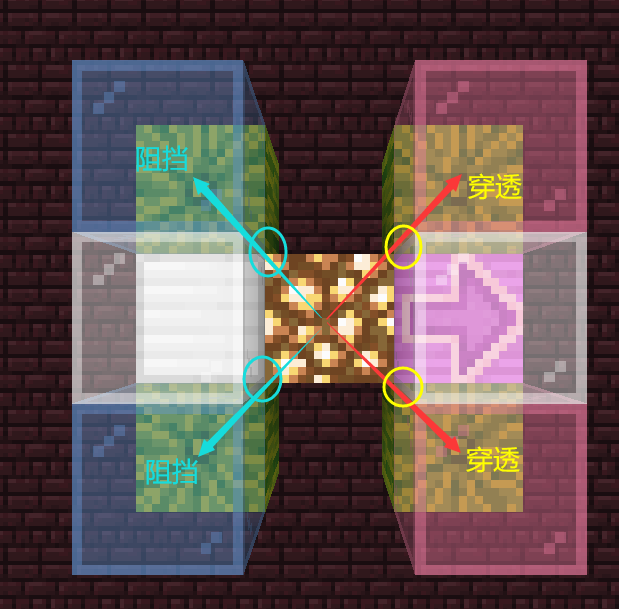

# [1.12.2] 末影人西瓜农场 (15.0k/h)

**摘要：**

**关键词：**「」

# **引言**

## **意义**

在1.8~1.13.2的游戏版本中，获取绿宝石的最主要且最可靠的途径是与农民职业的村民进行交易，用于交易的物品分别为小麦、土豆、萝卜、西瓜块、南瓜。在此用途中，虽然这五种物品的效益和成本有优劣之分，但交易的总体原则是「玩家出售的物品种类越多，则交易过程越轻松、稳定」。因此，每一种物品的自动化批量生产都是很有必要的。

除西瓜块以外，另外四种物品可以利用村民或活塞的机制，设计简单装置，实现自动化等级为4的全自动生产。对于西瓜块，如果采用与活塞南瓜农场相同的装置，则需要将直接产出的西瓜片合成为西瓜块，自动化等级仅为1。如果采用玩家精准采集的方式，最高只能实现自动化等级为3的半自动生产，仍然无法实现全自动。

然而，1.9版本更新时添加了「末影人死亡时掉落手持的方块」的特性。利用此特性，让末影人自然生成后拾起西瓜块并掉落，即可实现全自动生产，其自动化等级与另外四种物品相同。至此，五种用于获取绿宝石的交易原材料均可实现全自动批量生产。

## **背景与条件**

末影人西瓜农场设计方案通常有末影螨式和机械式。其中末影螨式是主流方案，但本设计采用机械式方案。

对于任意设计方案，末影人西瓜农场一般可以抽象地分解为两个组件：刷怪塔和瓜田。在估计和分析末影人西瓜农场的效率时，需要综合考虑刷怪塔和瓜田的相关数学模型。由于1.16版本更新更改了末影人占用生物容量的机制，刷怪塔模型发生了较大变化，因此本文不考虑。

本设计成果适用于1.12.2。在不加特殊说明的情况下，下文的所有讨论也默认仅考虑1.12.2，不保证在其他任何版本的适用性。

# **理论效率分析模型**

## **效率预测思路**

末影人西瓜农场（以下简称「小黑瓜机」或「瓜机」）是刷怪塔与作物农场的结合，我们很容易想到瓜机效率的计算方法：
$$产瓜效率 = 刷怪效率 \times 搬瓜率$$
- 刷怪效率：单位时间内末影人生成的数量（单位：末影人/h）
- 搬瓜率：给定任意一只末影人，在其完整生命周期内搬走西瓜的概率（取值范围是 $[0, 1]$ ，常用百分数表示）
- 产瓜效率：单位时间内输出西瓜物品的数量（单位：西瓜/h），反映农场的总产出效率，也称为「总效率」

公式中的两个相乘的因数分别反映了「刷怪塔（小黑塔）」与「作物农场（瓜田）」各自的指标。

简单考虑瓜机的运行过程可知，刷怪效率与搬瓜率是一对存在矛盾的变量：两者的共同影响因素是末影人的存活时间（lifetime）。在保持其他条件一致的情况下，刷怪效率与存活时间负相关，搬瓜率与存活时间正相关，有可能出现以下极端情况：
- 如果存活时间极短，则刷怪效率达到最高，但搬瓜率几乎为0，总效率也几乎为0
- 如果存活时间极长，则搬瓜率几乎达到100%，但刷怪效率几乎为0，总效率也几乎为0
- 存活时间取到某个中间值，刷怪效率与搬瓜率既不是最高也不是最低，但总效率达到最高

由此公式很容易想到，要想使总效率最高，不应该孤立地考虑增加刷怪效率或增加搬瓜率，而应该使两个参数之间达到平衡，使两者的乘积尽可能大。由于这两个变量互相矛盾，所以我们有必要用可靠的数学公式分别描述两个变量，从而准确地分析它们的乘积随各个原始参数变化的规律，最终确定结构设计参数。

## **刷怪效率的预测**

由于我们现在想追求极限效率，又因为其他基本因素的影响，所以对刷怪效率的计算作了以下假设：
1. 以单人世界为评价标准环境，刷怪上限为70
2. 刷怪面积足够大，任意时间断面的存活末影人数量约等于刷怪上限
3. 采用拌线钩检测式处理，存活时间集中在某个确定值附近
4. 不考虑极大的刷怪面积导致的「存活末影人数量略高于刷怪上限」的部分

为方便数学描述，用单字母符号表示以下变量：
- 刷怪上限： $C = 70$
- 存活时间： $l$ ，待定参数；单位可采用gt（游戏刻）或h（小时）， $1\mathrm{h}=72000\mathrm{gt}$ ；在单维度情况下，包含死亡动画的20gt
- 刷怪效率： $S$ ，末影人生成的效率，单位为mob/gt或mob/h

下面给出刷怪效率的计算方法。

首先假想一个 $C = 1$的简单情况，第2条的要求「任意时间断面的存活末影人数量约等于刷怪上限」此时体现为「任意时间断面都恰好有1只存活的末影人」。

粗略考虑一下过程：在某一个 $t$ 时刻，第 $(n-1)$ 只末影人被移除，第 $n$ 只末影人生成；经过一个生命周期，在 $(t+l)$ 时刻，第 $n$ 只末影人被移除，第 $(n+1)$ 只末影人生成，重复上一个周期的过程。此时，平均每经过 $l$ 时间移除并生成1只末影人，刷怪效率为：
$$S_1 = \frac{1}{l}$$

将上述过程推广到 $C$ 取任意值的情况。考虑将生物容量分割成 $C$ 个抽象的单元，每个单元的容量为1，且每个单元均满足第2条的要求。由于各个单元保持满容量状态，末影人被移除时立即生成下一只末影人，所以各个单元互不干扰，总刷怪效率是 $C$ 个单元刷怪效率 $S_1$ 的线性叠加：
$$S = C\cdot S_1 = \frac{C}{l}$$

在使用该公式时，需要注意时间单位的对应。如果采用常用单位，则需要使用以下换算后的公式：
$$刷怪效率\mathrm{(mob/h)} = \frac{刷怪上限\mathrm{(mob)} \times 72000\mathrm{(gt/h)}}{存活时间\mathrm{(gt)}}$$

## **搬瓜率的预测**

与刷怪效率预测类似，对于搬瓜率的预测，也作出以下假设：
1. 瓜田的总面积足够大，末影人搬瓜导致的瓜损失可以忽略，不影响瓜密度
2. 末影人在途径有瓜的部分时，有效瓜密度保持不变；即不考虑末影人移动与瓜田层分布的离散性，按平均值考虑
3. 末影人的生命周期可以二元化地分为无瓜和有瓜两阶段，不考虑瓜密度的渐变（本质与第2条相同）
4. 瓜田的布局完全断绝了末影人放下方块或搬起除瓜以外其他方块的可能性

在上述假设下，给出以下可能涉及的变量及其符号：
- 工作时间： $w$ ，单位为gt，末影人途径有瓜部分的时长；在单维度情况下，是存活时间的一部分，小于存活时间
- 有效瓜体积： $V$ ，在有瓜的部分，末影人可以搬起的瓜的总体积
- 有效瓜密度： $\mu$ ，在有瓜的部分，末影人可以搬起的瓜的体积占可搬区域体积的比例
- 搬瓜AI执行概率： $\varepsilon$ ，见下文
- 搬瓜AI创建概率： $\varepsilon _0$ ，见下文
- 瞬时搬瓜概率： $p$ ，给定任意一只空手的末影人和某一gt，在该gt搬起瓜的概率；可考虑等效平均值
- 总搬瓜率： $G$ ，（上文已介绍）给定任意一只末影人，在其完整生命周期内搬走西瓜的概率

与刷怪塔部分相比，瓜田部分的原理更加复杂。为了节省篇幅，本文只对关键的结论作简要介绍，不涉及过多细节。

### **末影人搬瓜尝试**

平均意义上，末影人每gt以 $\varepsilon$ 的概率尝试搬瓜，其中涉及AI任务创建与执行的概率。对于1.12.2，数据如下：
$$\varepsilon _0 = \frac{1}{20}$$
$$\varepsilon = \frac{\varepsilon _0+\varepsilon _0^2+\varepsilon _0^3}{3} = \frac{421}{24000} \approx \frac{1}{57} \approx 0.01754$$

需要注意，在1.12.2，尝试搬瓜的平均概率并不是 $\varepsilon_0 = 1/20$ ，而是 $\varepsilon \approx 1/57$ ，这与1.14+有所区别。

在实际的细节上，各个gt的尝试搬瓜的概率不是相同的，而是以3gt为周期变化， $1/57$ 只是平均值。但在不考虑离散情况优化的条件下，可以用平均值来指导设计。

### **目标瓜的选取**

在尝试搬瓜时，末影人会以自身为中心，取一个高 $3.0\mathrm{m}$ ，宽 $4.0\times4.0\mathrm{m^2}$ 的长方体；其中垂直方向的范围与自身高度基本一致，水平方向的范围则以自身的坐标为中心。上述计算采用实数型的实体坐标，而非整数型的方块坐标。记该区域为 $A$ ，其体积为：
$$V_A = 4.0 \times 3.0 \times 4.0 = 48.0$$

在下文中，以角标 $e, b, c$ 分别表示普通实体坐标、方块坐标、方块中心实体坐标。

在$A$区域内，末影人以按体积均匀分布的概率随机抽取一个实体坐标，记作：
$$Q_e = \left(Q_e.x, Q_e.y, Q_e.z\right)$$

$Q_e$所在的方块坐标为：
$$Q_b = \left(Q_b.x, Q_b.y, Q_b.z\right)$$

换算关系为：

$$
\begin{cases}
Q_b.x = \left\lfloor Q_e.x\right\rfloor\\
Q_b.y = \left\lfloor Q_e.y\right\rfloor\\
Q_b.z = \left\lfloor Q_e.z\right\rfloor\\
\end{cases}
$$

如果 $Q_b$ 对应的方块是瓜，则进入下一步判断：目标瓜有效性的判定。

### **目标瓜有效性判定**

$Q_b$对应的方块中心坐标（方块中心位置的实体坐标）为：
$$Q_c = \left(Q_c.x, Q_c.y, Q_c.z\right)$$

换算关系为：

$$
\begin{cases}
Q_c.x = Q_b.x + 0.5 = \left\lfloor Q_e.x\right\rfloor + 0.5\\
Q_c.y = Q_b.y + 0.5 = \left\lfloor Q_e.y\right\rfloor + 0.5\\
Q_c.z = Q_c.z + 0.5 = \left\lfloor Q_e.z\right\rfloor + 0.5\\
\end{cases}
$$

同理，考虑末影人自身所在的实体坐标 $P_e$，计算相应的所在方块中心的坐标 $P_c$。

从末影人所在方块的中心到目标瓜所在方块中心，在目标瓜中心所在的高度上，连一条水平方向的有向线段 $\overrightarrow{P_c^Q Q_c}$ ；需要特别注意 $P_c^Q$ 的坐标：
$$P_c^Q = \left(P_c.x, Q_c.y, P_c.z\right)$$

在有向线段 $\overrightarrow{P_c^Q Q_c}$ 上进行射线检测。如果射线遇到的第一个方块即为目标瓜，即目标瓜与末影人之间无阻挡，则此瓜为有效瓜。在1.12.2中，流体和无碰撞箱的方块不会形成阻挡；有碰撞箱的方块，构成阻挡的范围并不是碰撞箱，而是与玩家指针交互的范围。例如，栅栏形成阻挡的范围只有1.0格高，而不是1.5格高。

当需要考虑方块边缘对角线上的阻挡时，射线检测的阻挡条件具有与方向有关的部分穿透性。记有向线段为以下向量：

$$
\vec{\xi} = \overrightarrow{P_c^Q Q_c} =
\begin{pmatrix}
\xi.x\\
\xi.y\\
\xi.z\\
\end{pmatrix}; \xi.y = 0
$$

当 $\xi.x > 0$ ，即射线存在向东的分量时，可以从方块边缘对角线穿透；否则会形成阻挡。如下图所示：

对于此特性的进一步解释，可见下文的具体设计参数分析或其他相关资料，结合游戏内实验进行更充分了解。本文不再过多解释。

### **有效瓜密度**

根据上述步骤，对与 $A$ 区域存在交集的每个方块进行有效性检查，得到所有的有效瓜，将 $A$ 区域触及的全部有效瓜所在的完整方块组成的区域为 $R$ 。则以下区域的体积即为有效瓜体积：
$$M = R \cap A$$
将区域 $M$ 的体积记为 $V = V_M$ ，则有效瓜密度为：
$$\mu = \frac{V_M}{V_A} = \frac{V}{48}$$

需要注意，在本文的环境下，我们关心的有效瓜密度是有瓜阶段的平均有效瓜密度。

### **搬瓜率**

根据上述选取和判定有效瓜的过程，可以得出末影人在空手的条件下，某一gt的搬瓜概率：
$$p = \varepsilon\cdot\mu = \varepsilon\cdot\frac{V}{V_A}$$

在末影人处于有瓜阶段时，瞬时搬瓜概率均可视为 $p$ ，工作时长为 $w\mathrm{(gt)}$ ，则末影人在全过程中搬到瓜的概率为：
$$G = 1 - \left(1-p\right)^w = 1 - \left(1 - \varepsilon\cdot\frac{V}{V_A}\right)^w$$

## **产瓜效率的数学模型**

将上述两部分模型结合起来，即可得到产瓜效率 $m$ 的理论预测公式：

$$m = S\cdot G = \frac{C}{l} \cdot \left(
    1 - \left(1 - \varepsilon\cdot\frac{V}{V_A}\right)^w
\right)$$

根据上文的前提条件，此公式中 $C, \varepsilon, V_A$ 的值是恒定的，总效率 $m$ 只受到可变参数 $l, w, V$ 的影响。这三个参数就是我们在设计小黑瓜机时需要考虑的主要参数：
- $l$：末影人存活时间（ $\mathrm{gt}$ ）
- $w$：末影人工作时间（ $\mathrm{gt}$ ）
- $V$：有效瓜体积（ $\mathrm{m^3}$ ）

其中，$l, w$ 都是时间参数，两者之间有一定的关联，不妨再引入以下两个变量：
- $t_d$：末影人死亡动画占用的时间，恒定值， $t_d = 20 \mathrm{gt}$
- $r$：「闲置时间」，末影人处于无瓜部分的时间，不包含死亡动画

上述时间参数的关系为：

$$l = w + r + t_d$$

以 $w, r, V$ 为核心参数，总输出效率 $m$ 的公式：

$$m = m\left(w, r, V\right) = \frac{C}{w + r + t_d} \cdot \left(
    1 - \left(1 - \varepsilon\cdot\frac{V}{V_A}\right)^w
\right)$$

各个因子的公式：
$$m = S\cdot G$$
$$S = S\left(w,r\right) = \frac{C}{w + r + t_d}$$
$$G = G\left(w,V\right) = 1 - \left(1 - \varepsilon\cdot\frac{V}{V_A}\right)^w$$

# **参数选取与结构设计**

$$m\left(w, r, V\right) = \frac{C}{w + r + t_d} \cdot \left(
    1 - \left(1 - \varepsilon\cdot\frac{V}{V_A}\right)^w
\right)$$

## **产瓜效率公式分析**

对上文得到的公式 $m\left(w, r, V\right) = S\left(w,r\right)\cdot G\left(w,V\right)$ 作进一步分析。

三个参数的可能取值不会超过以下范围：

$$
w\in\left[0, +\infty\right),
r\in\left[0, +\infty\right),
V\in\left[0, V_A\right]
$$

实际可能的取值范围小于上述范围。例如，对于 $V$ ，由于结构的限制，实际上无法取到 $V_A$ ，必然有 $V < V_A$ 。

$w, r, V$ 是互相独立的变量，考虑 $m$ 随各个参数变化的关系：

$$\frac{\partial m}{\partial r}
= G\cdot\frac{\partial S}{\partial r}
= G\cdot\frac{-C}{\left(w + r + t_d\right)^2}$$

$$\frac{\partial m}{\partial V} = S\cdot\frac{\partial G}{\partial V}
= w\cdot\frac{\varepsilon}{V_A}\cdot\left(1 - V\cdot\frac{\varepsilon}{V_A}\right)^{w-1}\cdot S$$

经过简单分析可以发现，在其他条件不变的情况下，$m$ 随 $r, V$ 的变化都是单调的。

对于闲置时间 $r$ ，

$$G\left(w,V\right) > 0; C = 70 > 0;\\
\frac{\partial m}{\partial r}
= G\left(w,V\right)\cdot\frac{-C}{\left(w + r + t_d\right)^2} < 0$$

$m$ 随 $r$ 单调减少。

对于有效瓜体积 $V$ ，

$$\frac{V}{V_A}\cdot\varepsilon < \frac{V_A}{V_A}\cdot 1 = 1;\\
1 - V\cdot\frac{\varepsilon}{V_A} > 1 - 1 = 0;\\
\frac{\partial m}{\partial V}
= \frac{\varepsilon w\cdot S\left(w,r\right)}{V_A}\cdot\left(1 - V\cdot\frac{\varepsilon}{V_A}\right)^{w-1} > 0$$

$m$ 随 $V$ 单调增加。

这两个结论都是显然、符合直觉、容易想到的。在设计过程中，要想达到尽可能高的总效率，就需要尽可能地增大有效瓜体积（瓜密度）、减小闲置时间，而不需要考虑这两个参数的平衡。

因此，参数 $r, V$ 可以被视作关键的技术瓶颈，是决定瓜机总效率的根本参数，对这一部分的优化是游戏内结构设计工作的最核心环节。

与另外两个参数不同，工作时间参数 $w$ 对 $m$ 的影响不是单调的，我们需要研究其极值点。对于本文的游戏外理论分析，需要在给定任意 $r, V$ 取值的条件下给出 $w$ 的最佳取值。

$w$ 对 $m$ 的影响关系：

$$\frac{\partial m}{\partial w}
= \frac{\partial S}{\partial w}\cdot G + \frac{\partial G}{\partial w}\cdot S$$

其中，各因子体现为：

$$\frac{\partial S}{\partial w}
= \frac{-C}{\left(w + r + t_d\right)^2} < 0$$

$$\frac{\partial G}{\partial w}
= -\left(1 - V\cdot\frac{\varepsilon}{V_A}\right)^w\cdot\ln{\left(1 - V\cdot\frac{\varepsilon}{V_A}\right)};\\
\ln{\left(1 - V\cdot\frac{\varepsilon}{V_A}\right)} < 0;
\frac{\partial G}{\partial w} > 0$$

这两个分量分别描述了工作时间（或存活时间）的变化对刷怪速率、搬瓜率造成的互相抑制的影响。两者总计的影响为：

$$\frac{\partial m}{\partial w}
= -\frac{C}{w + r + t_d}\left(1 - V\cdot\frac{\varepsilon}{V_A}\right)^w\cdot\ln{\left(1 - V\cdot\frac{\varepsilon}{V_A}\right)}\\
-\frac{C}{\left(w + r + t_d\right)^2}\left(1 - \left(1 - V\cdot\frac{\varepsilon}{V_A}\right)^w\right)
$$

简记以下中间变量：

$$\alpha = \alpha\left(V\right)
= 1 - p = 1 - V\cdot\frac{\varepsilon}{V_A};\\
\beta = \beta\left(r\right) = r + t_d$$

则公式重新表述为：

$$m = \frac{C\left(1 - \alpha^w\right)}{w + \beta}$$

$$\frac{\partial m}{\partial w}
= \frac{C}{w + \beta}
\left(
    \alpha^w\ln{\frac{1}{\alpha}}
    - \frac{1 - \alpha^w}{w + \beta}
\right)$$

$m$ 的极值点与极值点并不容易用显然的方法求得。因此，我们先讨论 $r, V$ 的取值，在参数确定的情况下再回来对 $m\left(w\right)$ 的极大值（或最大值）进行数值计算。

## **结构设计流程概述**

本文的机械式小黑瓜机包含两部分：瓜田部分和刷怪塔部分。

末影人在刷怪平台上生成，启动刷怪平台的机械装置，经过位置和动量矫正后进入下落管道中的有瓜部分（瓜田）。这个过程需要的时间即为「闲置时间」 $r$ ，它描述了刷怪塔的响应速度，越小越好。

随后，末影人在下落管道中移动，有一定概率搬起西瓜。决定这一概率的关键参数是有效瓜密度，通常也可用有效瓜体积 $V$ 来衡量，这是决定瓜田收割速率的参数，越大越好。

瓜田的各层之间采用重复的布局。末影人在下落管道中经历的时间是 $w$ ，本文称为「工作时间」，是需要专门讨论的参数。下落管道的长度是决定此变量的主要原始参数之一，但也需要考虑减速带、弹射装置等其他影响。

末影人到达下落管道最底端，立即死亡，最后的死亡动画占用 $t_d = 20\mathrm{gt}$ 的时间，随后生命周期结束。

根据上述数学模型，再考虑到不同部分的设计难度不同，可以尝试分析出以下较为合理的设计流程：

1. 【瓜田单层设计】先确定瓜田每一层的布局，得到尽可能高的瓜密度。
2. 【刷怪平台设计】由于瓜田对末影人的水平位置有较精确的要求，需要进行坐标矫正，这需要刷怪平台的配合；所以刷怪平台的设计应放在瓜田设计之后，同时得到尽可能短的闲置时间。
3. 【瓜田管道设计】计算得到最优或较优的工作时间参数 $w$ ，适当选取瓜田堆叠的层数，适当考虑减速带的布局，使测量得到的末影人实际工作时间（可由存活时间、下落时间等易测量参数换算）基本接近 $w$ 的值。如果将水作为减速带，还需要考虑末影人传送对刷怪结构的影响，设计防传送、防生物残留的结构。
4. 【区段空间优化】在设计瓜田管道时，对于1.12.2-，也需要考虑heightMap的影响，尽可能完整地利用区段（子区块）空间，使刷怪速率与瓜生长速率尽量平衡：较大的方块高度有利于扩大瓜田总规模，较小的区段高度有利于提高刷怪速率。虽然在规模足够大的农场中此类优化作用不大，但在有条件进行优化时也不应浪费机会。需要注意，这项优化需要在保证 $w$ 维持在最优水平的前提下进行，不应本末倒置。

上述顺序只反映了大致的流程。实际上，各个部分之间存在多方向的影响，前一阶段的设计也需要依照后一阶段设计的成果而进行修改。设计流程需要反复迭代多次。

*（瓜密度的平均可能并不应该算术平均（？））*

## **瓜田单层布局简介**

## **刷怪结构简介**

## **最优时间参数分析**

## **下落管道布局简介**

# **结构细节与优化**

# 相关资料

- @Mojong, @Minecraft wiki. [15w31c](https://minecraft.fandom.com/zh/wiki/15w31a#%E7%94%9F%E7%89%A9_2)
- @Naftalluvia. [[MC]游戏过程自动化程度分级参考标准](https://www.bilibili.com/read/cv16418212)
- @Fallen_Breath. [末影人西瓜农场笔记](https://fallenbreath.me/2023/01/08/endermelon-notes/)
