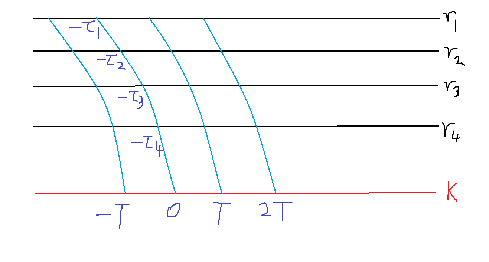

# 集中处死式刷怪塔的一种理论模型

## 概述

在本模型中，怪物数量（生物量）、时间、刷怪面积、生物容量等都可以（但不必要）取任意实数，而非游戏中实际所取的整数。实际游戏中生物的生成是概率性生成整数个生物，但本模型将其简化成按其均值均匀地生成数量为实数的生物，将整数的“生物数目”抽象成实数的“生物量”。

假设集中处死式刷怪塔以传送带方式运行（以凋零骷髅塔为例），具有“运行周期”和“处理时长”两个参数。传送带运行的时刻、生物被处死的时刻都是确定且离散的值，又因为生物生成的时刻是连续均匀分布的，所以生物的存活时间也不是定值。

这里的传送带是一个抽象的概念，是指生物整体周期性运动所经过的有向轨迹。传送带的运动需要时间，在不同位置生成的生物移动到处死时的位置所需的时间有可能不同。

将传送带从生物生成的位置移动到“移除”位置（“移除”是指从生物容量中移除，其方式包括但不限于死亡、跨维度、捡起装备等）所需的时间成为该位置的“本征延迟”，这是在该位置生成的生物可能的最小存活时间。由此可以定义一个从“位置”（ $\vec{r}$ ）到“本征延迟”（ $\tau$ ）的关系：

$$
\tau = \tau\left[\vec{r}\right]
$$

假设生物容量无穷大或者生物数量未达到上限，则每个位置都有与之对应的生物自然生成速率。在单位面积下，称其为“生成强度”（ $U$ ）。暂时只考虑1种生物，有以下关系：

$$
U = U\left[\vec{r}\right]
$$

将所有可能的生物生成位置的集合记为 $\Omega$ ，则刷怪塔在自然状态下（生物容量无穷大或者生物数量未达到上限）的总生成速率符合以下描述：

$$
w = \sum_{\vec{r}\in\Omega}{U\left[\vec{r}\right]\cdot 1}
$$

如果考虑位置连续， $\Omega$ 是所有生成位置形成的连续空间，有以下描述：

$$
w = \int_{\Omega}{U\left[\vec{r}\right]\cdot{\mathrm{d}\Omega}}
$$

以下将以连续空间假设为主，从而有利于借助量纲的关系来理解相关概念(?)。生成强度特指单位面积的生成速率，“生成速率”就默认指一定范围内的总生成速率，不用再加“总”字。

名称 | 量纲 | 常用符号
:-: | :-: | :-:
生成强度 | $\dfrac{生物量}{时间\times 面积}$ | $U, u$
生成速率 | $\dfrac{生物量}{时间}$ | $w, v$
本征延迟 | $时间$ | $\tau$

在后续分析中，需要用到这样一个参数：本征延迟相同的一组生物的生成速率。在这之前要先定义“本征延迟相同的位置组成的空间” $\Omega\left[\tau _0\right]$ ：

$$
\Omega\left[\tau _0\right] = \left\{\vec{r}|\vec{r}\in\Omega \wedge \tau\left[\vec{r}\right] = \tau _0\right\}
$$

“从本征延迟到生成速率的关系”定义如下：

$$
w\left[\tau\right] = \int_{\Omega\left[\tau\right]}{U\left[\vec{r}\right]\cdot{\mathrm{d}\Omega}}
$$

## 单延迟、无上限

此情况下，所有生物本征延迟相同（这在刷怪塔中已经不多见，反而常见于时钟式作物农场），刷怪塔一直处在自然生成状态。

记刷怪塔全局统一的本征延迟为 $\tau$ ，运行周期为 $T$ ，生成空间为 $\Omega$ （其面积 $\int_{\Omega}{\mathrm{d}\Omega} = S$ ），自然生成强度为 $U\left[\vec{r}\right]$ （ $\vec{r}\in\Omega$ ， $u$ 不一定是常数）。

生成速率维持恒定值：

$$
w = \int_{\Omega}{U\left[\vec{r}\right]\cdot{\mathrm{d}\Omega}}
$$

假设刷怪塔无始无终地运行，每当 $t = kT \left(k \in \mathbb{Z}\right)$ 的时刻进行一次处死。在一次处死中，能够处理到的生物的生成时刻应分布在以下区间：

$$
\left[\left(k-1\right)T - \tau, kT - \tau\right)
$$

这里的边界值是否应当被包含是个无关紧要的问题，因为生成过程是连续的。

反过来从生物的角度考虑：一个生物生成之后，总是要等到传送带第一次经过该生物时才正式进入处理范围，而传送带到达的时刻总是 $t = kT - \tau \left(k \in \mathbb{Z}\right)$ ，这些传送带到达时刻将生物生成时刻划分为各个区间，每个区间内的生物在同一批次中被处理。

不妨取 $k = 0$ ，由此可以很简单地导出刷怪塔的总效率：

$$
W = \frac{1}{T}\int_{-\tau}^{T-\tau}{w\cdot{\mathrm{d}t}} = \frac{1}{T}\cdot{wT} = w
$$

显然，这一整段的推导都是废话，但并不是毫无营养的，而是为了演示相关概念，为更复杂的情况提供参考。

## 单延迟、有上限

与上述单一延迟模型类似，但此处引入了有限的生物容量。此时，生物生成就面临两种情况：生物总量小于容量时，按自然生成速率生成；生物总量等于容量时，不生成，速率为 $0$ 。由于模型中生物生成被简化成连续过程，因此不会出现生物总量大于容量的情况；或者说，可以在模型中将生物容量设定为已经考虑过实际离散情况下过度生成现象的值。

将生物容量记为 $M$ ，在时刻为 $t$ 时存活的生物量记为 $m = m\left[t\right]$ 。

生成速率与存活生物量有关。将自然生成速率记为 $w$ ，实际生成速率记为 $v$ ：

$$
v\left[t\right] = \begin{cases}
  w & \text{ if: } m\left[t\right] < M \\
  0 & \text{ if: } m\left[t\right] \ge M \\
\end{cases}
$$

存活生物量是生物的生成和移除随时间积累的综合结果。在本模型中，生成是连续的，移除是离散、突变的。因此，存活生物量始终小于或等于生物容量；在一次移除之后，总是需要一段时间才可能将存活生物量恢复到容量，也可能因为时间太短或速率太低而仅能恢复到容量以下的一个值。

考虑各个时刻与周期的关系。给定一个时刻 $t$ ，如果作为生物移除时间轴上的时刻，可以给出它所在的处理批次编号 $k = k\left[t\right]$ ，表示在此批次处理的生物的之前经历的生成批次；如果作为生物生成时刻，也可以给出它所在的生成周期的编号 $g = g\left[t\right]$ ，表示在此时生成的生物即将面临的处理批次。具体关系为：

$$
\left(k-1\right)T \le t < kT \left(k\in\mathbb{Z}\right)
$$

$$
\left(g-1\right)T-\tau \le t < gT-\tau \left(g\in\mathbb{Z}\right)
$$

同一时刻的两个编号通常具有关系：

$$
k\left[t\right] \le g\left[t\right]
$$

$k, g$ 的值可以由 $t$ 导出：

$$
\kappa\left[t\right] = \left\lfloor\frac{t}{T}\right\rfloor; k\left[t\right] = \kappa\left[t\right]+1
$$

$$
\gamma\left[t\right] = \left\lfloor\frac{t+\tau}{T}\right\rfloor; g\left[t\right] = \gamma\left[t\right]+1
$$

其中， $\kappa\left[t\right], \gamma\left[t\right]$ 分别表示上一个已完成的生成批次、处理批次的序号。

仍然假设生物容量永远不会被填满，则存活生物量呈现以下规律：

$$
m\left[t\right] = \int_{\kappa\left[t\right]\cdot T-\tau}^{t}
{w\cdot{\mathrm{d}t}} = w\cdot(t-\kappa\left[t\right]\cdot T+\tau)
$$

存活生物量表示当前已经生成但尚未处理的生物量，即在上次处理时刻对应的生成时刻之后、当前时刻之前生成的所有生物。需要注意，这与当前时刻的生成批次并无直接关系，“当前处死批次对应的生成批次”并不是“当前生成批次”。

由 $k$ 与 $t$ 的关系可以得出以下关系：

$$
w\cdot\tau \le m\left[t\right] < w\left(T+\tau\right)
$$

再考虑生物容量可能被填满的情况，存活生物量的规律应为：

$$
m\left[t\right] = \int_{\kappa\left[t\right]\cdot T-\tau}^{t}
{v\left[t\right]\cdot{\mathrm{d}t}}
$$

从上一次处死的时刻 $t' = \kappa\left[t\right]\cdot T$ 到下一次处死的时刻 $t' = k\left[t\right]\cdot T$ 之间应存在一个生物总量刚刚达到生物容量 $M$ 的时刻 $t' = \kappa\left[t\right]\cdot T + T_\mu$ ，其中 $T_\mu$ 是从处死到填满的时间差。这时填满的生物都是在上一次处死对应的生成批次中生成的，即在时刻 $t' = \kappa\left[t\right]\cdot T - \tau$ 之后生成，应满足以下关系：

$$
m\left[\kappa T + T_\mu\right]
= \int_{\kappa T - \tau}^{\kappa T + T_\mu}{v\left[t'\right]\cdot{\mathrm{d}t'}}
= M
$$

为求解 $T_\mu$ ，需要先考虑 $v\left[t\right]$ 的变化情况：

- 在处死之后、填满之前，取值为 $w$ ；
- 在填满之后、处死之前，取值为 $0$ 。

具体表示如下：

$$
v\left[t\right] = \begin{cases}
  w & \text{ if: } 
  \left(\kappa\left[t\right]\cdot T\right) 
  \le t < 
  \left(\kappa\left[t\right]\cdot T+ T_\mu\right) \\
  0 & \text{ if: } 
  \left(\kappa\left[t\right]\cdot T+ T_\mu\right) 
  \le t < 
  \left(k\left[t\right]\cdot T\right) \\
\end{cases}
$$

不妨仅考虑 $0 \le t < T$ 的情况，此时 $\kappa = 0, k = 1$ ，

$$
v\left[t\right] = \begin{cases}
  w & \text{ if: } 0 \le t < T_\mu \\
  0 & \text{ if: } T_\mu \le t < T \\
\end{cases}
$$

$$
m\left[T_\mu\right]
= \int_{-\tau}^{T_\mu}{v\left[t\right]\cdot{\mathrm{d}t}}
= M
$$

从 $t = -\tau$ 到 $t = T_\mu$ ， $v\left[t\right]$ 可能经历若干次 $0$ 与 $w$ 之间的循环。

令 $\tau = \alpha T + \beta \left(\alpha \in \mathbb{N} \wedge 0 \le \beta < T\right)$ ，即本征延迟 $\tau$ 包含了 $\alpha$ 余 $\beta$ 个运行周期 $T$ 。考虑从 $t = -\alpha T - \beta$ 到 $t = T_\mu$ 的过程。

上述过程中，从 $t = 0$ 到 $t = T_\mu$ 是一个完整的 $w$ 阶段，从 $t = -\alpha T$ 到 $t = 0$ 恰好包含 $\alpha$ 个完整的运行周期，两者合计必然包含 $\left(\alpha+1\right)$ 个完整的 $w$ 阶段。

从 $t = -\alpha T -\beta$ 到 $t = -\alpha T$ ：如果 $\beta \le T - T_\mu$ ，则仅包含 $0$ 阶段；如果 $\beta > T - T_\mu$ ，则又包含了 $\left(\beta + T_\mu - T\right)$ 长度的 $w$ 阶段。

因此，从 $t = -\tau$ 到 $t = T_\mu$ 经历的 $w$ 阶段时长是：

$$
T_w = \begin{cases}
  \left(\alpha+1\right) T_\mu & \text{ if: } \beta \le T - T_\mu \\
  \left(\alpha+1\right) T_\mu + \left(\beta + T_\mu - T\right) & \text{ if: } \beta > T - T_\mu \\
\end{cases}
$$

$$
T_w = \left(\alpha+1\right) T_\mu + \max\left[0, \beta + T_\mu - T\right]
$$

$$
\begin{cases}
  \alpha = \left\lfloor\dfrac{\tau}{T}\right\rfloor\\ 
  \beta = \tau - \alpha T = \tau - T\left\lfloor\dfrac{\tau}{T}\right\rfloor\\
\end{cases}
$$

$$
T_w = \left(\left\lfloor\frac{\tau}{T}\right\rfloor+1\right) T_\mu + \max\left[0, \tau + T_\mu - T\left\lfloor\frac{\tau}{T}\right\rfloor - T\right]
$$

$$
T_w = \begin{cases}
  \left(\alpha+1\right) T_\mu & \text{ if: }
  T_\mu \le \left(\alpha+1\right)T - \tau \\
  \left(\alpha+2\right) T_\mu + \tau - \left(\alpha+1\right) T & \text{ if: }
  T_\mu > \left(\alpha+1\right)T - \tau \\
\end{cases}
$$

代入求解 $T_\mu$ 所需的关系，可得：

$$
M = m\left[T_\mu\right] = \int_{-\tau}^{T_\mu}{v\left[t\right]\cdot{\mathrm{d}t}} = w T_w
$$

$$
T_\mu = \begin{cases}
  \dfrac{M}{w\left(\alpha+1\right)} & \text{ if: }
  M \le w\left(\alpha+1\right)\left(T-\beta\right) \\
  \dfrac{M+w\left(T-\beta\right)}{w\left(\alpha+2\right)} & \text{ if: }
  M > w\left(\alpha+1\right)\left(T-\beta\right) \\
\end{cases}
$$

或完全用 $\alpha$ 表示为：

$$
T_\mu = \begin{cases}
  \dfrac{M}{w\left(\alpha+1\right)} & \text{ if: }
  M \le w\left(\alpha+1\right)\left(T-\beta\right) \\
  T + \dfrac{\frac{M}{w}-\left(T+\tau\right)}{\alpha+2} & \text{ if: }
  M > w\left(\alpha+1\right)\left(T-\beta\right) \\
\end{cases}
$$

此关系成立的条件是 $w\left(T+\tau\right) > M$ 。

因此，在有可能达到上限的情况下，存活生物量的完整规律应为：

$$
m\left[t\right] = \begin{cases}
  w\left(\alpha T_\mu + t - \kappa T\right) & \text{ if: }
  \left(\kappa T \le t <\kappa T + T_\mu\right) \wedge \left(M \le w\left(\alpha+1\right)\left(T-\beta\right)\right) \\  w\left(\left(\alpha+1\right)\left(T_\mu-T\right)+\tau + t - \kappa T\right) & \text{ if: }
  \left(\kappa T \le t <\kappa T + T_\mu\right) \wedge \left(M > w\left(\alpha+1\right)\left(T-\beta\right)\right) \\
  M & \text{ if: }
  \kappa T + T_\mu \le t < \kappa T + T \\
\end{cases}
$$

即：

$$
m\left[t\right] = \begin{cases}
  \frac{\alpha M}{\alpha+1} + w\left(t - \kappa T\right) & \text{ if: }
  \left(\kappa T \le t <\kappa T + T_\mu\right) \wedge \left(M \le w\left(\alpha+1\right)\left(T-\beta\right)\right) \\

  \frac{\left(\alpha+1\right)\left(M-wT\right)}{\alpha+2} + \frac{w\tau}{\alpha+2} + w\left(t - \kappa T\right) & \text{ if: }
  \left(\kappa T \le t <\kappa T + T_\mu\right) \wedge \left(M > w\left(\alpha+1\right)\left(T-\beta\right)\right) \\

  M & \text{ if: }
  \kappa T + T_\mu \le t < \kappa T + T \\
\end{cases}
$$

一般情况下， $m\left[t\right]$ 在 $t = nT \left(n\in\mathbb{Z}\right)$ 处右侧连续而左侧不连续，这反映了生物集中处死的特点。

综合以上结论，可以推导出刷怪塔产出的平均效率，即每个周期内有效处死的生物量：

$$
W
= \frac{1}{T}\left(m\left[0^-\right] - m\left[0^+\right]\right)
= \frac{1}{T}\left(\lim_{t\to 0^-}{m\left[t\right]} - m\left[0\right]\right)
$$

$$
m\left[0\right] = \begin{cases}
  \frac{\alpha M}{\alpha+1} & \text{ if: }
  M \le w\left(\alpha+1\right)\left(T-\beta\right) \\

  \frac{\left(\alpha+1\right)\left(M-wT\right)}{\alpha+2} + \frac{w\tau}{\alpha+2} & \text{ if: }
  M > w\left(\alpha+1\right)\left(T-\beta\right) \\
\end{cases}
$$

$$
W = \begin{cases}
  \frac{1}{T}\left(M - \frac{\alpha M}{\alpha+1}\right) & \text{ if: }
  M \le w\left(\alpha+1\right)\left(T-\beta\right) \\

  \frac{1}{T}\left(M - \frac{\left(\alpha+1\right)\left(M-wT\right)}{\alpha+2} + \frac{w\tau}{\alpha+2}\right) & \text{ if: }
  M > w\left(\alpha+1\right)\left(T-\beta\right) \\
\end{cases}
$$

$$
W = \begin{cases}
  \dfrac{M}{T\left(\alpha+1\right)} & \text{ if: }
  M \le w\left(\alpha+1\right)\left(T-\beta\right) \\

  \dfrac{\left(\alpha+1\right)w}{\alpha+2} + \dfrac{M + w\tau}{T\left(\alpha+2\right)} & \text{ if: }
  M > w\left(\alpha+1\right)\left(T-\beta\right) \\
\end{cases}
$$

再考虑未达到上限的情况，综合表示为：

$$
W = \begin{cases}
  w & \text{ if: }
  \frac{M}{wT} > 1+\frac{\tau}{T} \\\\

  \dfrac{M}{\left(\left\lfloor\frac{\tau}{T}\right\rfloor+1\right)T} & \text{ if: }
  \frac{M}{wT} \le \left(1+\left\lfloor\frac{\tau}{T}\right\rfloor\right)\left(1-\frac{\tau}{T} + \left\lfloor\frac{\tau}{T}\right\rfloor\right) \le 1+\frac{\tau}{T} \\\\

  \dfrac{\left(\left\lfloor\frac{\tau}{T}\right\rfloor+1\right)wT+M+w\tau}{\left(\left\lfloor\frac{\tau}{T}\right\rfloor+2\right)T} & \text{ if: }
  \left(1+\left\lfloor\frac{\tau}{T}\right\rfloor\right)\left(1-\frac{\tau}{T} + \left\lfloor\frac{\tau}{T}\right\rfloor\right) < \frac{M}{wT} \le 1+\frac{\tau}{T} \\
\end{cases}
$$

## 多延迟、无上限

此情况下，各个刷怪位置的本征延迟不一定相等；由于存活生物量一直小于容量，所以生物一直处于自然生成状态。如果不考虑生物容量，可以认为这种模型描述了需要人工处死的传送带时钟式刷怪塔的典型情况：传送带的运动需要时间，靠近传送带起点的位置本征延迟较大，靠近传送带终点的位置本征延迟较小。

记刷怪塔全局统一的运行周期为 $T$ ，生成空间为 $\Omega$ （其面积 $\int_{\Omega}{\mathrm{d}\Omega} = S$ ），各个位置的自然生成强度为 $U\left[\vec{r}\right]$ （ $\vec{r}\in\Omega$ ），本征延迟为 $\tau\left[\vec{r}\right]$ 。

由于一直处在自然生成状态，容易发现刷怪塔平均效率应为：

$$
W = \iint_{\Omega}{U\left[\vec{r}\right]\cdot{\mathrm{d}\Omega}}
$$

为了对有上限的情况进行铺垫，先在无上限的情况下考虑存活生物量的变化情况。

和单延迟的情况类似，生物集中处死的时刻仍然为 $t = nT \left(n\in\mathbb{Z}\right)$ 。

对于一个给定的本征延迟 $\tau _i$ ，给定时刻的存活生物量应当为：从上一次处死时刻对应的生成时刻开始，到当前时刻为止，这一时段生成的所有本征延迟为 $\tau _i$ 的生物量。将本征延迟在 $\Omega$ 内的各个位置的全部可能取值都按照面积和生成强度综合加权考虑，即可得到综合的存活生物量变化规律。

以下段落中，默认以大写的 $U\left[\vec{r}\right]$ 表示自然生成强度，以小写的 $u\left[\vec{r}, t\right]$ 表示实际生成强度；这类似于 $w$ 与 $v\left[t\right]$ 的关系。

对于无上限或永远不达到上限的情况， $\left(\forall t\in\mathbb{R}\right) u\left[\vec{r}, t\right] = U\left[\vec{r}\right]$ 。

$$
m\left[t\right] = \iint_{\Omega}{
  \int_{\kappa\left[t\right]\cdot T - \tau\left[\vec{r}\right]}
  ^{t}{u\left[\vec{r}, t'\right] {\mathrm{d}t'}}
  \cdot{\mathrm{d}\Omega}}
$$

与“生物量”相对，上述积分式中 $\Omega$ 上的被积函数所描述的变量被定义为“生物密度”，其决定式（而非定义式）为：

$$
\rho\left[\vec{r}, t\right] = \int_{\kappa\left[t\right]\cdot T - \tau\left[\vec{r}\right]}
  ^{t}{u\left[\vec{r}, t'\right] {\mathrm{d}t'}}
$$

按相应情况计算，得到：

$$
\rho\left[\vec{r}, t\right] = \int_{\kappa\left[t\right]\cdot T - \tau\left[\vec{r}\right]}
  ^{t}{U\left[\vec{r}\right] {\mathrm{d}t}}
= U\left[\vec{r}\right]\cdot\left(t - \kappa\left[t\right]\cdot T + \tau\left[\vec{r}\right]\right)
$$

$$
m\left[t\right] = \iint_{\Omega}{
  \rho\left[\vec{r}, t\right]
  \cdot{\mathrm{d}\Omega}}
= \left(t - \kappa\left[t\right]\cdot T\right)\iint_{\Omega}{
  U\left[\vec{r}\right]\cdot{\mathrm{d}\Omega}}
+ \iint_{\Omega}{
  U\left[\vec{r}\right]\cdot\tau\left[\vec{r}\right]
  \cdot{\mathrm{d}\Omega}}
$$

以上表达式提到了上文出现过的 $\kappa\left[t\right]$ ，表示“上一个处死时刻的序号”，因此仍然仅与时刻 $t$ 有关而与本征延迟 $\tau$ 无关。其计算方式不随延迟而改变，与上文相同：

$$
\kappa\left[t\right] = \left\lfloor\frac{t}{T}\right\rfloor
$$

同时定义一个更便于表达的量，直接表示“上一个处死时刻”：

$$
T_\kappa \left[t\right] = \kappa\left[t\right]\cdot T = \left\lfloor\frac{t}{T}\right\rfloor\cdot T
$$

根据存活生物量 $m\left[t\right]$ 的表达式，按照对集中处死过程的描述来重新推导刷怪塔的效率：

$$
W = \frac{1}{T}\left(m\left[0^-\right] - m\left[0^+\right]\right) = \frac{1}{T}\left(\lim_{t\to 0^-}{m\left[t\right]} - m\left[0\right]\right)
$$

$$
W = \frac{1}{T}\left(
   T\iint_{\Omega}{
  U\left[\vec{r}\right]\cdot{\mathrm{d}\Omega}}
  + \iint_{\Omega}{
  U\left[\vec{r}\right]\cdot\tau\left[\vec{r}\right]
  \cdot{\mathrm{d}\Omega}}
  - \iint_{\Omega}{
  U\left[\vec{r}\right]\cdot\tau\left[\vec{r}\right]
  \cdot{\mathrm{d}\Omega}}
\right)
$$

$$
W = \iint_{\Omega}{
  U\left[\vec{r}\right]\cdot{\mathrm{d}\Omega}}
$$

这与本段开头采用直觉直接得出的结论相同，初步验证了 $m\left[t\right]$ 表达式的正确性。并且，这种情况其实与“单延迟、无上限”没有任何区别——在无上限的情况下，延迟对平均效率没有任何影响。

## 多延迟、有上限

与单延迟的情况类似，要将无上限的情况扩展为有上限的情况，主要步骤是确定两个相邻处死时刻之间生物容量被填满的时刻，对填满前后分别计算生成速率和存活生物量，再根据处死时存活生物量的变化情况（左右极限之差）得到平均效率。

与生成速率类似，考虑生成强度的变化情况：

$$
u\left[\vec{r}, t\right] = \begin{cases}
  U\left[\vec{r}\right] & \text{ if: } 
  T_\kappa \left[t\right]
  \le t < 
  T_\kappa \left[t\right] + T_\mu \\
  0 & \text{ if: } 
  T_\kappa \left[t\right] + T_\mu 
  \le t < 
  T_\kappa \left[t\right] + T \\
\end{cases}
$$

$T_\mu$ 是从处死到填满所需的时间。在编号为 $0$ 的周期附近采样，定义如下：

$$
m\left[T_\mu\right]
= \iint_{\Omega}{
  \int_{-\tau\left[\vec{r}\right]}
  ^{T_\mu}{u\left[\vec{r}, t\right] {\mathrm{d}t}}
  \cdot{\mathrm{d}\Omega}}
= M
$$

按照生物密度考虑，有以下关系：

$$
\rho\left[\vec{r},T_\mu\right]
= \int_{-\tau\left[\vec{r}\right]}
  ^{T_\mu}{u\left[\vec{r}, t\right] {\mathrm{d}t}}
$$

$$
m\left[T_\mu\right]
= \iint_{\Omega}{
  \rho\left[\vec{r},T_\mu\right]
  \cdot{\mathrm{d}\Omega}}
= M
$$

从 $-\tau$ 到 $T_\mu$ ，相应的生成位置和生物需要经历若干个周期，与单延迟的情况类似；由于此处 $-\tau$ 与位置有关，所以不同位置对应的周期数量可能是不同的。

将位置 $\vec{r}$ 处的存活生物密度积累需要经历的实际有效生成（生成强度为 $U\left[\vec{r}\right]$ ）时长记为 $T_w\left[\vec{r}\right]$ ，仿照单延迟的结论可以推出以下关系：

$$
T_w\left[\vec{r}\right] = \begin{cases}
  \left(\alpha\left[\vec{r}\right]+1\right) T_\mu & \text{ if: }
  T_\mu \le \left(\alpha\left[\vec{r}\right]+1\right)T - \tau\left[\vec{r}\right] \\
  \left(\alpha\left[\vec{r}\right]+2\right) T_\mu + \tau\left[\vec{r}\right] - \left(\alpha\left[\vec{r}\right]+1\right) T & \text{ if: }
  T_\mu > \left(\alpha\left[\vec{r}\right]+1\right)T - \tau\left[\vec{r}\right] \\
\end{cases}
$$

$$
\begin{cases}
  \alpha\left[\vec{r}\right] = \left\lfloor\dfrac{\tau\left[\vec{r}\right]}{T}\right\rfloor\\ 
  \beta\left[\vec{r}\right] = \tau\left[\vec{r}\right] - \alpha\left[\vec{r}\right]\cdot T = \tau\left[\vec{r}\right] - T\left\lfloor\dfrac{\tau\left[\vec{r}\right]}{T}\right\rfloor\\
\end{cases}
$$
